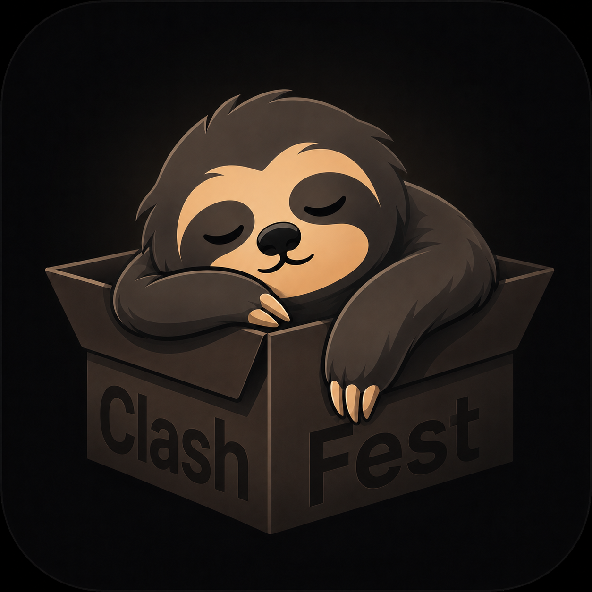
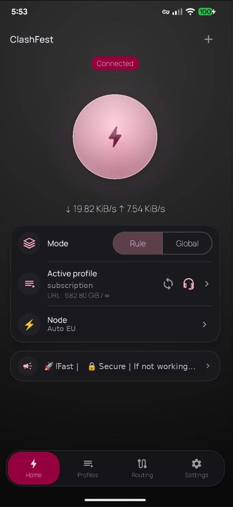
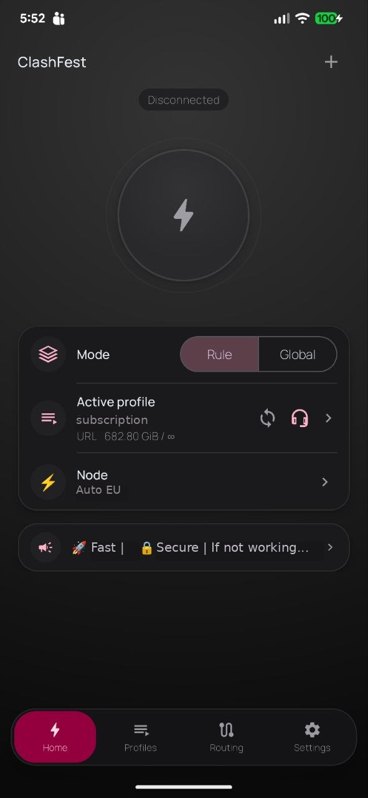
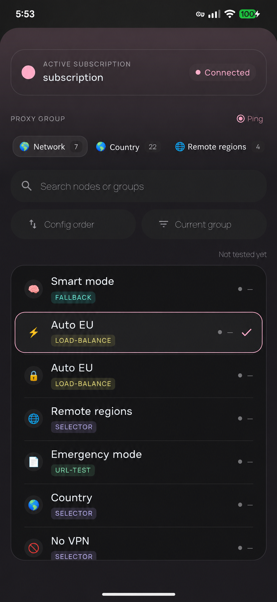
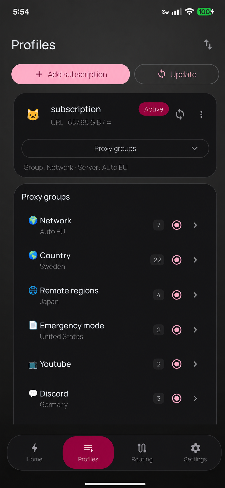
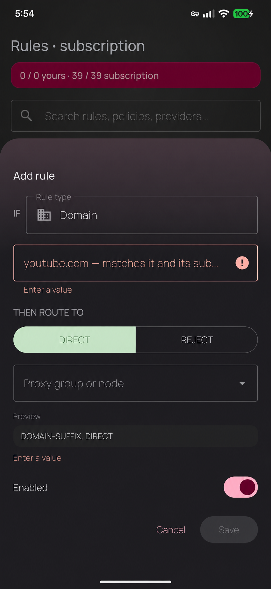
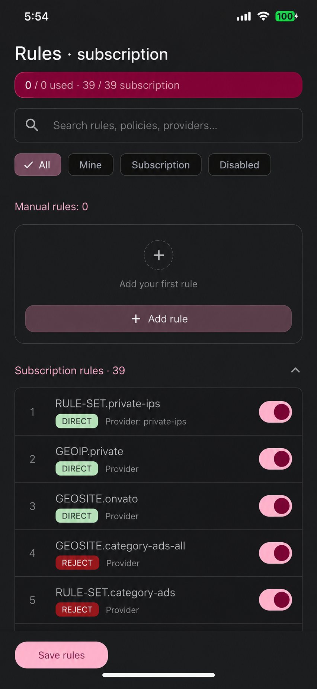
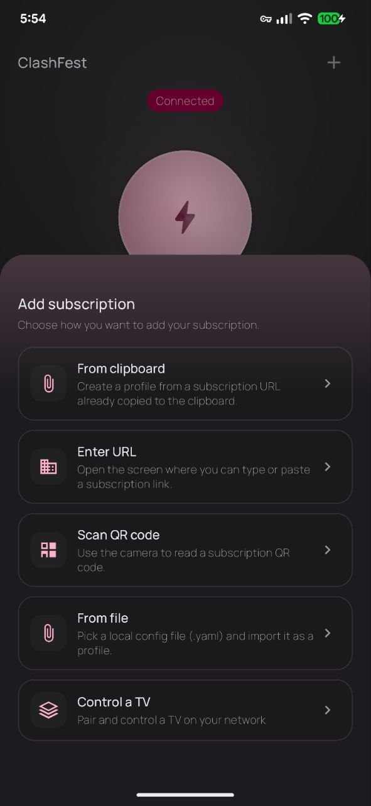
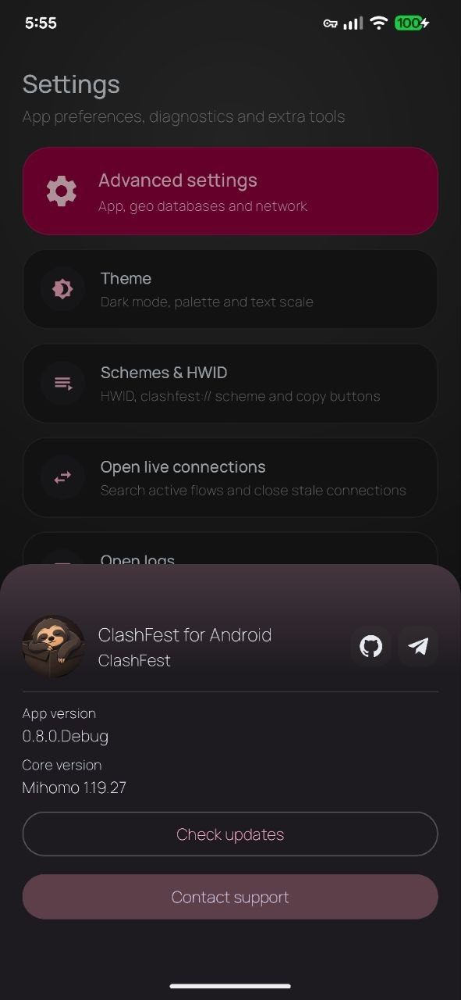

<h1 align="center">
  
</h1>

<p align="center">
  <b>Clash Meta (Mihomo)</b> client for <b>Android</b> — phone &amp; Android&nbsp;TV<br />
  Redesigned Home · cleaner subscriptions &amp; nodes · routing tools · safe defaults
</p>

<p align="center">
  <a href="https://github.com/Nemu-x/ClashFest/wiki"><b>📖 Wiki</b></a> ·
  <a href="https://t.me/nemux_dev">Telegram</a> ·
  <a href="https://github.com/Nemu-x/ClashFest/releases">Releases</a> ·
  <a href="https://github.com/Nemu-x/ClashFest/issues">Issues</a> ·
  <a href="ROADMAP.md">Roadmap</a> ·
  <a href="LICENSE">License</a>
</p>

<p align="center">
  
  
  
  
</p>

---

**ClashFest** is an Android client in the **Clash Meta / Mihomo** family — a redesigned Home
experience, cleaner subscription/node flows, routing-focused tools, and practical safety
defaults for everyday use.

> 💬 Questions, bugs, feature requests → **[Telegram (EN / RU)](https://t.me/nemux_dev)** or **[GitHub issues](https://github.com/Nemu-x/ClashFest/issues)**.

---

## Highlights

| Area | What you get |
|------|----------------|
| **Home** | Active node card, compact subscription actions, circular tab swipe, import from URL / QR / clipboard |
| **Widget** | Home-screen speed widget — live ↑/↓ rate, tap to connect/disconnect (responsive: 1 cell = on/off, wider = live speed) |
| **Modes** | Rule / Global quick switch from Home |
| **Profiles** | Dedicated Profiles tab manager with collapsible proxy groups + per-profile **read-only config viewer** (YAML highlighting, copy / share) |
| **Proxy chain** | Chain two proxies per profile (first hop → exit) with explicit *save* vs *use-now* and optional YAML preview |
| **Rules & routing** | Dedicated Routing hub, rule snippets, effective rules, app routing (per‑app VPN policy) |
| **DNS & network** | Per-profile DNS / hosts editor, **Block IPv6 (AAAA)** toggle, VPN options, security-oriented toggles |
| **Features** | Safe “every‑day” toggles (unified delay, geodata mode, TCP concurrent) + entry to **Geo Data Source** |
| **Geo Data Source** | Presets for **geox-url** mirrors (same upstream data, different CDN paths), custom URLs, on-device geo DB import |
| **Subscriptions** | HTTP(S) / `content:` profiles; **`mierus://`** shares parsed via the same pipeline as other URL imports |
| **Updates** | In-app manual update check, merged **About & updates**, Home indicator when an update is available |
| **Quick start** | Quick Settings tile flow with VPN permission handling and one-tap startup |
| **Android TV** | D-pad-friendly layout with focus navigation and a leanback banner — the same app on the big screen |
| **Companion / remote** | Pair a device over LAN via QR and drive ClashFest remotely — the external controller doubles as a **TV remote** |
| **Connections** | Live connections view with resilient snapshot decoding and lower polling load |
| **App** | Dark mode, pure-black (OLED), optional **UI language** (system / EN / RU / ZH), notification & recents options |
| **Look** | **Lumen** design language — obsidian surfaces, single-accent glow, Manrope + Space Grotesk type; sleeping-sloth branding |

## Screenshots

<table>
  <tr>
    <td width="50%" align="center"><br /><sub><b>Home — connected</b> — connect orb, mode, active node, live speed</sub></td>
    <td width="50%" align="center"><br /><sub><b>Home — idle</b> — disconnected state, one-tap connect</sub></td>
  </tr>
  <tr>
    <td width="50%" align="center"><br /><sub><b>Nodes</b> — grouped picker with latency, search &amp; protocol chips</sub></td>
    <td width="50%" align="center"><br /><sub><b>Profiles</b> — subscriptions, proxy groups, per-profile tools</sub></td>
  </tr>
  <tr>
    <td width="50%" align="center"><br /><sub><b>Rules</b> — intent-style add / edit, DIRECT · REJECT · route to group</sub></td>
    <td width="50%" align="center"><br /><sub><b>Routing</b> — subscription + user rules in effective order</sub></td>
  </tr>
  <tr>
    <td width="50%" align="center"><br /><sub><b>Import</b> — add a subscription / profile from URL, QR or clipboard</sub></td>
    <td width="50%" align="center"><br /><sub><b>Settings</b> — about &amp; updates, appearance, language, network</sub></td>
  </tr>
</table>

---

## Roadmap

What we're building next, what's planned, and what's out of scope lives in
**[ROADMAP.md](ROADMAP.md)** — including community feature requests and why some
are or aren't a fit. Have an idea? Open an [issue](https://github.com/Nemu-x/ClashFest/issues).

**Current focus**

- Stability and regression-free releases on top of the redesigned Home
- Routing and profile management polish without breaking upstream compatibility
- Performance and battery optimizations in high-refresh screens
- Localization quality (EN / RU / ZH first, others incremental)
- Post-release cleanup of medium-risk technical debt

---

## Repository layout

| Module | Role |
|--------|------|
| `app/` | Activities, navigation, packaging |
| `common/` | Shared helpers (imports, naming, ping helpers, …) |
| `core/` | JNI bridge, native **Mihomo** integration |
| `design/` | UI, themes, layouts, preference screens |
| `service/` | VPN service, profiles, rule merge / **Geo** presets |

---

## Build

**Requirements**

- Android Studio (or compatible IDE)
- Android SDK + **NDK** as required by the project
- **JDK 21** (required — the native `:hideapi` step fails silently on older JDKs)
- Gradle wrapper (included)

**Debug (default `alpha` flavor)**

```bash
# Linux / macOS
./gradlew assembleAlphaDebug
```

```powershell
# Windows
.\gradlew.bat assembleAlphaDebug
```

---

## Branding

- App icon & README logo: the **sleeping-sloth** mark — part of the same brand family as
  [SlothClash](https://github.com/Nemu-x/SlothClash). Source art: `design/ClashFest.png`
  (with wordmark) · `design/ClashFest_notxt.png` (mark only).
- Screenshots & notes live in `docs/`.

---

## License

Licensed under the **GNU General Public License v3.0**. See `LICENSE` and `NOTICE`.

**Disclaimer** — ClashFest is provided **as-is**, without warranty. Use it responsibly and in
compliance with local law, provider terms, and upstream licenses.

---

## Upstream & related projects

ClashFest builds on the open Clash / Meta stack. If you use or ship derivatives, keep
**copyright and license notices** intact. If ClashFest is useful for you, consider giving the
project a star ⭐

| Project | What it is | Link |
|---------|----------------|------|
| **Clash Meta for Android** | Upstream Android client this tree forked from | [MetaCubeX/ClashMetaForAndroid](https://github.com/MetaCubeX/ClashMetaForAndroid) |
| **mihomo** | Clash.Meta core (Go) used under the hood | [MetaCubeX/mihomo](https://github.com/MetaCubeX/mihomo) |
| **Meta rules dat** | Community geo / ruleset data releases (our **Geo Data Source** presets mirror these) | [MetaCubeX/meta-rules-dat](https://github.com/MetaCubeX/meta-rules-dat) |
| **Mieru** | UDP port hopping VPN protocol; **mierus://** subscription links are supported as imports | [enfein/mieru](https://github.com/enfein/mieru) |
| **SlothClash (Desktop)** | Companion desktop client in the same ecosystem (Wails · Go · React) | [Nemu-x/SlothClash](https://github.com/Nemu-x/SlothClash) |
| **Documentation** | Mihomo / Meta docs (rules, parsers, …) | [wiki.metacubex.one](https://wiki.metacubex.one/) |
