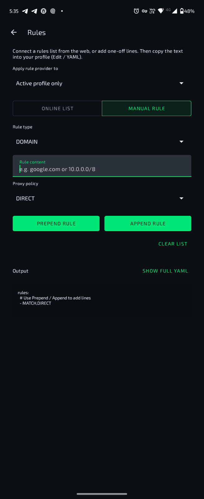
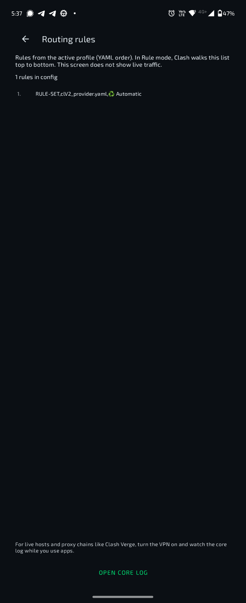

# ClashFest

<!--
https://img.shields.io/github/actions/workflow/status/Nemu-x/ClashFest/android-debug.yml?branch=feat/init-clashfest
-->


ClashFest is a modern Android client built on top of the Clash / Clash Meta ecosystem, with refreshed branding, a cleaner UI, slimmer profile cards, routing tools, and a more expressive visual style.

> Status: work in progress  
> Active branch: `feat/init-clashfest`

## Highlights

- ClashFest branding and app identity
- Modernized home screen with slim profile cards
- Rule / Global / Direct mode switching
- Profile management with quick actions
- Rules and routing related tools
- Connections / traffic inspection screens
- Neon-accent dark UI direction
- Light theme support in progress
- Delay / ping related helpers
- Subscription import helpers

## Screenshots

> Recommended screenshot location inside the repo: `docs/screenshots/`

| Home | Connections |
|---|---|
|  |  |

| Rules: online list | Rules: manual |
|---|---|
|  |  |

| Routing rules | Profile options |
|---|---|
|  |  |

| Add profile |
|---|
|  |

### Suggested screenshot file names

Copy your current screenshots into:

- `docs/screenshots/home.png`
- `docs/screenshots/connections.png`
- `docs/screenshots/online_list.png`
- `docs/screenshots/manual_rule.png`
- `docs/screenshots/routing_rules.png`
- `docs/screenshots/profile_options.png`
- `docs/screenshots/add_profile.png`

## Project Structure

- `app/` — Android app entry points, activities, packaging
- `common/` — shared utilities and helpers
- `core/` — native/core bridge, tunnel interaction, low-level logic
- `design/` — UI layer, layouts, themes, adapters, design logic
- `service/` — background service, profile management, rule helpers

## Current Focus

- stabilizing the redesigned home screen
- finishing ClashFest branding across all user-facing screens
- improving rules and routing UX
- improving connections visibility
- fixing theme inconsistencies, especially light theme
- cleaning up temporary and experimental code safely
- polishing launcher and app icon assets

## Build

### Requirements

- Android Studio
- Android SDK / NDK required by the project
- JDK compatible with the project
- Gradle wrapper included in the repository

### Debug build

Linux / macOS:

```bash
./gradlew assembleAlphaDebug
```

Windows:

```powershell
.\gradlew.bat assembleAlphaDebug
```

## Branding Assets

Recommended asset location:

- `app/src/main/res/drawable-nodpi/clashfest_shield.png`

Optional folders:

- `branding/` — source branding assets
- `docs/` — documentation materials

## License

This project is licensed under the GNU General Public License v3.0.

See:

- `LICENSE`
- `NOTICE`

## Upstream / Attribution

ClashFest is a fork / derivative built on top of the Clash Android ecosystem.

Original copyright notices, license terms, and attribution requirements must be preserved where applicable.

## Disclaimer

ClashFest is provided as-is, without warranty.

Use it at your own responsibility and in accordance with:

- local laws
- service terms
- upstream license requirements

## Development Notes

This repository is currently being actively reworked in a personal feature branch.

The current implementation includes:

- UI redesign work
- branding updates
- rules and routing tooling experiments
- connections inspection work
- subscription UX improvements

## Contributing

At this stage, development is focused on the ClashFest fork workflow and internal iteration.
Contribution guidelines may be expanded later.
