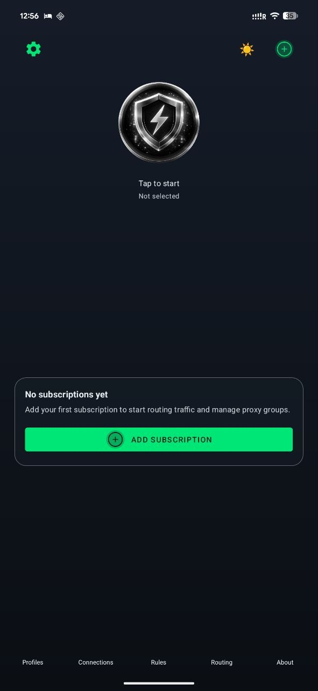
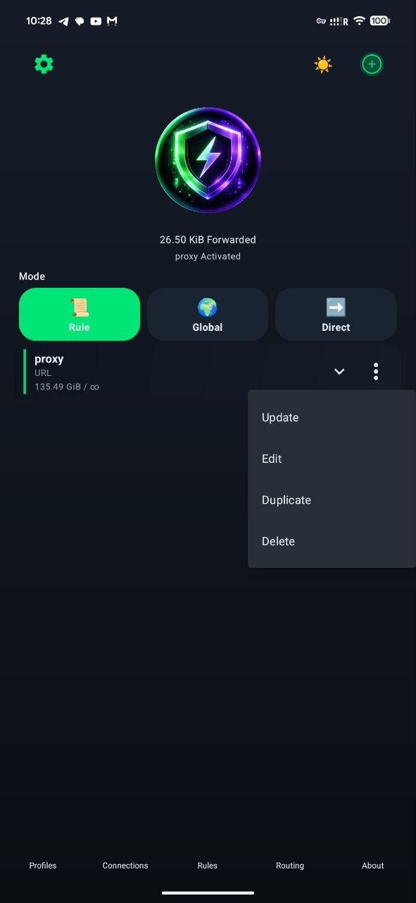

# ClashFest

<!--
https://img.shields.io/github/actions/workflow/status/Nemu-x/ClashFest/android-debug.yml?branch=feat/init-clashfest
-->


**ClashFest** is an Android client in the **Clash Meta / Mihomo** family: refreshed branding, a calmer home screen with compact profile cards, routing helpers, and room to grow without inheriting every upstream UI choice.

> **Status:** work in progress · **Active branch:** `feat/init-clashfest`

---

## Highlights

| Area | What you get |
|------|----------------|
| **Home** | Slim profile cards, quick actions, import from URL / QR / clipboard |
| **Modes** | Rule / Global / Direct tunnel modes |
| **Rules & routing** | Rule snippets, effective rules, app routing (per‑app VPN policy) |
| **Network** | DNS / VPN options, security-oriented toggles where we wire them |
| **Features** | Safe “every‑day” toggles (unified delay, geodata mode, TCP concurrent) + entry to **Geo Data Source** |
| **Geo Data Source** | Presets for **geox-url** mirrors (same upstream data, different CDN paths), custom URLs, on-device geo DB import |
| **Subscriptions** | HTTP(S) / `content:` profiles; **`mierus://`** shares parsed via the same pipeline as other URL imports |
| **App** | Dark mode, optional **UI language** (system / EN / RU / ZH), notification & recents options |
| **Look** | Neon-accent dark direction; light theme still evolving |

### Screenshots

<p align="center">
  
  
  
  
</p>

<p align="center">
  
  
  
  
</p>

---

## Repository layout

| Module | Role |
|--------|------|
| `app/` | Activities, navigation, packaging |
| `common/` | Shared helpers (imports, naming, ping helpers, …) |
| `core/` | JNI bridge, native **Mihomo** integration |
| `design/` | UI, themes, layouts, preference screens |
| `service/` | VPN service, profiles, rule merge / **Geo** presets |

---

## Build

### Requirements

- Android Studio (or compatible IDE)
- Android SDK + **NDK** as required by the project
- **JDK** matching the Gradle toolchain (see project / CI notes)
- Gradle wrapper (included)

### Debug (default **alpha** flavor)

**Linux / macOS**

```bash
./gradlew assembleAlphaDebug
```

**Windows**

```powershell
.\gradlew.bat assembleAlphaDebug
```

---

## Branding & docs

- App shield: `app/src/main/res/drawable-nodpi/clashfest_shield.png`
- Optional: `branding/` — source art · `docs/` — screenshots & notes

---

## License

Licensed under the **GNU General Public License v3.0**. See `LICENSE` and `NOTICE`.

---

## Disclaimer

ClashFest is provided **as-is**, without warranty. Use it responsibly and in compliance with local law, provider terms, and upstream licenses.

---

## Contributing

Right now development is focused on the ClashFest fork and branch workflow; contribution guidelines may expand later.

---

## Upstream & related projects

ClashFest builds on the open Clash / Meta stack. If you use or ship derivatives, keep **copyright and license notices** intact.

| Project | What it is | Link |
|---------|----------------|------|
| **Clash Meta for Android** | Upstream Android client this tree forked from | [MetaCubeX/ClashMetaForAndroid](https://github.com/MetaCubeX/ClashMetaForAndroid) |
| **mihomo** | Clash.Meta core (Go) used under the hood | [MetaCubeX/mihomo](https://github.com/MetaCubeX/mihomo) |
| **Meta rules dat** | Community geo / ruleset data releases (our **Geo Data Source** presets mirror these) | [MetaCubeX/meta-rules-dat](https://github.com/MetaCubeX/meta-rules-dat) |
| **Mieru** | UDP port hopping VPN protocol; **mierus://** subscription links are supported as imports | [enfein/mieru](https://github.com/enfein/mieru) |
| **Documentation** | Mihomo / Meta docs (rules, parsers, …) | [wiki.metacubex.one](https://wiki.metacubex.one/) |

---

## Current focus

- Stabilize the redesigned home and profile flows
- Finish branding pass on remaining screens
- Rules / routing UX and connections clarity
- Light theme parity and polish
- Safe removal of experimental leftovers
